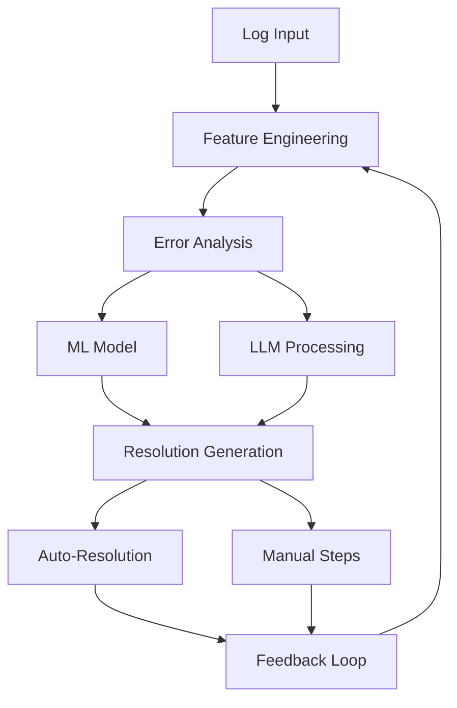
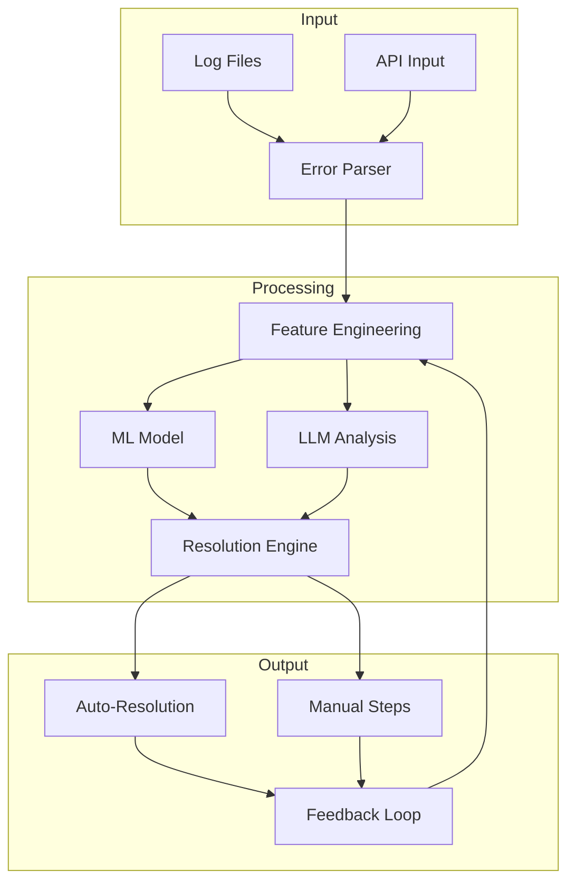
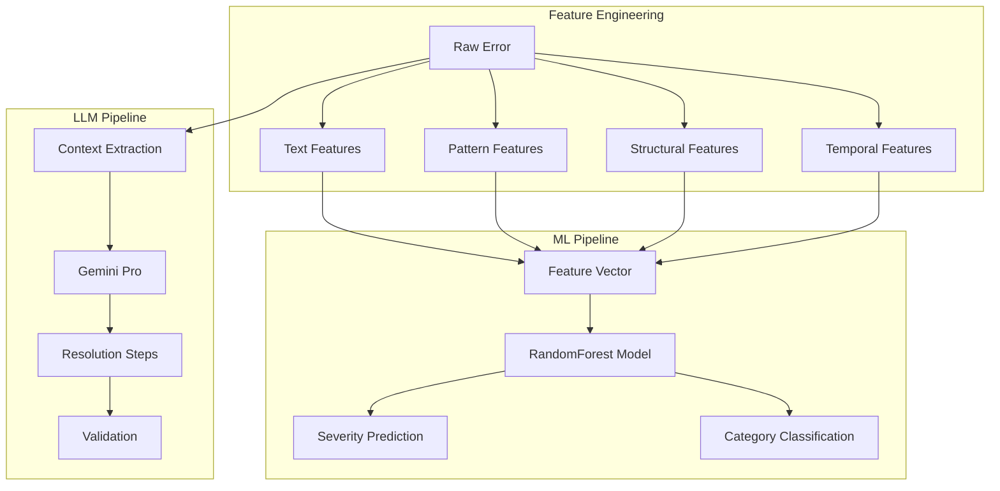
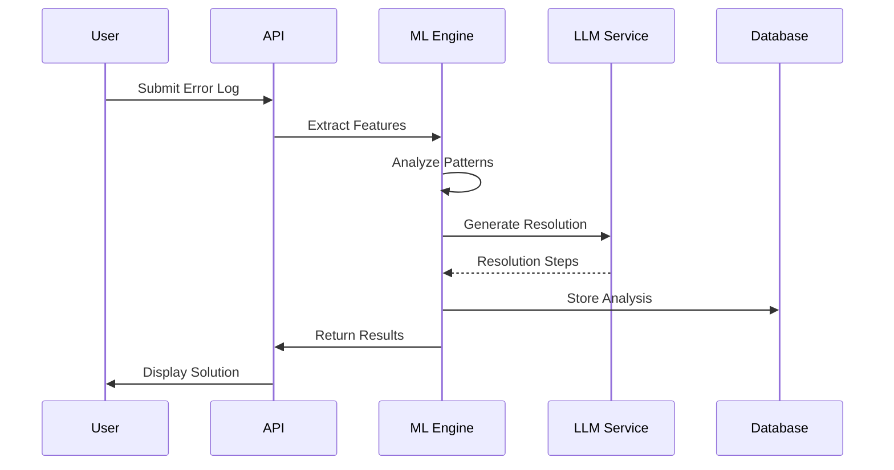

# ErrorScope AI: Complete System Documentation

## Table of Contents

1. [System Overview](#system-overview)
2. [Core ML Architecture](#core-ml-architecture)
3. [Feature Engineering](#feature-engineering)
4. [Model Training & Evaluation](#model-training-and-evaluation)
5. [LLM Integration](#llm-integration)
6. [Resolution Generation](#resolution-generation)
7. [System Implementation](#system-implementation)
8. [API Reference](#api-reference)
9. [Deployment Guide](#deployment-guide)
10. [Best Practices](#best-practices)
11. [Troubleshooting](#troubleshooting)
12. [Security](#security)
13. [Future Roadmap](#future-roadmap)

---



## System Overview

ErrorScope AI is a sophisticated error analysis and resolution system that combines traditional ML with modern LLM capabilities to provide intelligent error analysis and automated resolution suggestions.

### System Architecture



### Key Features

#### Real-time Analysis
- Error categorization using ML models
- Severity prediction based on historical patterns
- Business impact assessment
- Resource utilization analysis

#### Pattern Recognition
- Regular expression pattern matching
- Semantic similarity analysis
- Context-aware error grouping
- Historical pattern learning

#### LLM Integration
- Google Gemini Pro integration
- Context-aware resolution generation
- Step-by-step fix suggestions
- Code snippet generation

#### Self-Learning
- Feedback loop incorporation
- Pattern refinement
- Success rate tracking
- Model retraining triggers

## ML/AI Components

### Model Architecture



### Feature Engineering Pipeline

#### Text Feature Extraction

```python
def extract_text_features(error_message: str) -> Dict[str, Any]:
    """
    Extract textual features from error messages.
    
    Features:
    - Basic statistics (length, word count)
    - Character type ratios
    - Keyword presence
    - TF-IDF vectors
    """
    return {
        'message_length': len(error_message),
        'word_count': len(error_message.split()),
        'uppercase_ratio': sum(1 for c in error_message if c.isupper()) / len(error_message),
        'digit_ratio': sum(1 for c in error_message if c.isdigit()) / len(error_message),
        'special_char_ratio': sum(1 for c in error_message 
                                if not c.isalnum() and not c.isspace()) / len(error_message),
        'has_numbers': bool(re.search(r'\d+', error_message)),
        'has_special_chars': bool(re.search(r'[^a-zA-Z0-9\s]', error_message)),
        'tfidf_vector': compute_tfidf(error_message)
    }
```

#### Pattern Matching

```python
ERROR_PATTERNS = {
    'timeout': {
        'pattern': r'timeout|timed?\s*out',
        'severity': 'high',
        'category': 'performance'
    },
    'permission': {
        'pattern': r'permission\s*denied|access\s*denied',
        'severity': 'medium',
        'category': 'security'
    },
    'network': {
        'pattern': r'connection\s*(?:refused|reset|closed)',
        'severity': 'high',
        'category': 'connectivity'
    },
    'memory': {
        'pattern': r'out\s*of\s*memory|memory\s*(?:error|leak)',
        'severity': 'critical',
        'category': 'resource'
    }
}
```

### ML Model Configuration

```python
class ErrorClassifier:
    def __init__(self):
        self.model = RandomForestClassifier(
            n_estimators=100,
            max_depth=10,
            min_samples_split=5,
            min_samples_leaf=2,
            random_state=42,
            class_weight='balanced'
        )
        
        self.feature_pipeline = Pipeline([
            ('text_features', TextFeatureExtractor()),
            ('pattern_features', PatternFeatureExtractor()),
            ('structural_features', StructuralFeatureExtractor()),
            ('temporal_features', TemporalFeatureExtractor()),
            ('scaler', StandardScaler())
        ])
```

### LLM Integration

```python
class LLMResolver:
    def __init__(self, model_name: str = "gemini-pro"):
        genai.configure(api_key=os.getenv('GOOGLE_API_KEY'))
        self.model = genai.GenerativeModel(model_name)
        
    async def get_resolution(self, error_context: Dict[str, Any]) -> Dict[str, Any]:
        prompt = self._build_prompt(error_context)
        response = await self.model.generate_content(prompt)
        
        return {
            'steps': self._parse_steps(response.text),
            'code_snippets': self._extract_code(response.text),
            'confidence': self._calculate_confidence(response),
            'references': self._extract_references(response)
        }
        
    def _build_prompt(self, context: Dict[str, Any]) -> str:
        return f"""
        Analyze this error and provide a detailed resolution:
        
        Error Message: {context['message']}
        Stack Trace: {context.get('stack_trace', 'N/A')}
        Environment: {context.get('environment', {})}
        Previous Occurrences: {context.get('history', [])}
        
        Provide:
        1. Root cause analysis
        2. Step-by-step resolution
        3. Prevention measures
        4. Code examples if applicable
        5. Reference documentation
        """
```

### Technical Stack
    
    subgraph Backend
        B --> C[Flask Server]
        C --> D[ML Engine]
        C --> E[LLM Service]
        C --> F[Database]
    end
    
    subgraph ML Components
        D --> G[Feature Engineering]
        D --> H[Model Training]
        D --> I[Prediction Service]
    end
    
    subgraph Storage
        F --> J[SQLite/PostgreSQL]
        F --> K[Model Storage]
        F --> L[Error Patterns]
    end
```

### Component Interactions



### Architecture Overview
```
ml_engine/
├── core.py              # Core ML engine
├── feature_engineer.py  # Feature extraction
├── model_trainer.py     # Model training
├── error_analyzer.py    # Error analysis
├── enhanced_analyzer.py # Advanced analysis
├── llm_suggestor.py    # LLM integration
└── auto_resolver.py     # Auto-resolution
```

## Core ML Architecture

### A. Machine Learning Pipeline

#### 1. Feature Engineering Layer (`FeatureEngineer`)
```python
class FeatureEngineer:
    """Enhanced feature engineering for error analysis"""
    
    def __init__(self):
        self.vectorizer = TfidfVectorizer(
            max_features=1000,
            ngram_range=(1, 3),
            stop_words='english'
        )
        
        self.error_patterns = {
            'timeout': r'timeout|timed?\s*out',
            'permission': r'permission\s*denied|access\s*denied',
            'network': r'connection\s*(?:refused|reset|closed)',
            'memory': r'out\s*of\s*memory|memory\s*(?:error|leak)',
            'database': r'database\s*(?:error|connection|timeout)|sql',
            'syntax': r'syntax\s*error|invalid\s*(?:syntax|format)',
            'null': r'null\s*pointer|nullptr|none\s*type',
            'file': r'file\s*not\s*found|no\s*such\s*file'
        }

        self.feature_extractors = {
            'text_features': self._extract_text_features,
            'pattern_features': self._extract_pattern_features,
            'structural_features': self._extract_structural_features,
            'temporal_features': self._extract_temporal_features,
            'severity_features': self._extract_severity_features
        }
```

#### 2. Model Training Configuration (`ModelTrainer`)
```python
class ModelTrainer:
    def __init__(self):
        self.model = RandomForestClassifier(
            n_estimators=100,
            max_depth=10,
            min_samples_split=5,
            min_samples_leaf=2,
            random_state=42,
            class_weight='balanced'
        )
```

### B. Feature Sets

#### 1. Text Features
```python
def extract_text_features(error):
    return {
        'message_length': len(message),
        'word_count': len(message.split()),
        'uppercase_ratio': sum(1 for c in message if c.isupper()) / len(message),
        'digit_ratio': sum(1 for c in message if c.isdigit()) / len(message),
        'special_char_ratio': sum(1 for c in message if not c.isalnum() and not c.isspace()) / len(message),
        'has_numbers': bool(re.search(r'\d+', message)),
        'has_special_chars': bool(re.search(r'[^a-zA-Z0-9\s]', message))
    }
```

#### 2. Pattern Features
```python
def extract_pattern_features(error):
    return {
        'has_exception': 'exception' in message.lower(),
        'has_failed': 'fail' in message.lower(),
        'has_timeout': 'timeout' in message.lower(),
        'has_memory': 'memory' in message.lower(),
        'has_null': 'null' in message.lower(),
        'has_connection': 'connection' in message.lower(),
        'has_file': 'file' in message.lower(),
        'has_permission': 'permission' in message.lower()
    }
```

#### 3. Structural Features
```python
def extract_structural_features(error):
    return {
        'line_number': error.get('line_number', 0),
        'has_context': bool(error.get('context', {})),
        'context_keys_count': len(error.get('context', {})),
        'match_groups_count': len(error.get('match_groups', [])),
        'has_log_level': 'log_level' in context,
        'has_thread_id': 'thread_id' in context,
        'has_class_method_context': 'class_method' in context,
        'log_level_severity': map_log_level_severity(level)
    }
```

#### 4. Temporal Features
```python
def extract_temporal_features(error):
    return {
        'has_timestamp': bool(timestamp),
        'hour_of_day': dt.hour,
        'day_of_week': dt.weekday(),
        'is_weekend': dt.weekday() >= 5,
        'is_business_hours': 9 <= dt.hour <= 17
    }
```

#### 5. Severity Features
```python
def extract_severity_features(error):
    return {
        'severity_score': severity_mapping[severity],
        'is_critical': severity == 'critical',
        'is_high_severity': severity in ['critical', 'high'],
        'is_runtime_error': 'runtime' in category,
        'is_business_logic': 'business' in category,
        'is_system_error': category in ['resource', 'system'],
        'is_timeout_error': 'timeout' in error_type,
        'is_memory_error': 'memory' in error_type,
        'is_network_error': 'network' in error_type,
        'is_permission_error': 'permission' in error_type,
        'is_mapping_error': 'mapping' in error_type,
        'is_pricing_error': 'pricing' in error_type
    }
```

## Model Training & Evaluation

### A. Training Pipeline

```python
def train_model(errors):
    # 1. Feature Extraction
    features_df = feature_engineer.extract_features(errors)
    
    # 2. Prepare Data
    X = features_df.drop(['error_id', 'original_message', 'severity', 'type', 'category'], axis=1)
    y = features_df['severity']
    
    # 3. Label Encoding
    label_encoder = LabelEncoder()
    y_encoded = label_encoder.fit_transform(y)
    
    # 4. Train-Test Split
    X_train, X_test, y_train, y_test = train_test_split(
        X, y_encoded, test_size=0.2, random_state=42, stratify=y_encoded
    )
    
    # 5. Model Training
    model.fit(X_train, y_train)
    
    # 6. Evaluation
    y_pred = model.predict(X_test)
    metrics = calculate_metrics(y_test, y_pred)
    
    # 7. Cross-validation
    cv_scores = cross_val_score(model, X, y_encoded, cv=5)
    
    return {
        'model': model,
        'metrics': metrics,
        'cv_scores': cv_scores,
        'label_encoder': label_encoder,
        'feature_names': X.columns.tolist()
    }
```

### B. Evaluation Metrics
```python
def calculate_metrics(y_true, y_pred):
    return {
        'accuracy': accuracy_score(y_true, y_pred),
        'precision': precision_score(y_true, y_pred, average='weighted'),
        'recall': recall_score(y_true, y_pred, average='weighted'),
        'f1': f1_score(y_true, y_pred, average='weighted'),
        'confusion_matrix': confusion_matrix(y_true, y_pred).tolist()
    }
```

## LLM Integration

### A. Enhanced Error Suggestor
```python
class EnhancedErrorSuggestor:
    def __init__(self, error_map_path="data/error_map.json", 
                 use_llm=True,
                 model_name="gemini-pro",
                 min_confidence=0.85):
        self.use_llm = use_llm
        if use_llm:
            genai.configure(api_key=api_key)
            self.llm = genai.GenerativeModel(model_name)
        
        self.successful_patterns = {}
        self.pattern_feedback = {}
```

### B. LLM Suggestion Generation
```python
async def get_suggestion_with_llm(self, error, predicted_class=None):
    # 1. Check learned patterns first
    pattern_key = self._get_pattern_key(error)
    learned_suggestion = self._check_learned_patterns(error, pattern_key)
    if learned_suggestion:
        return learned_suggestion
    
    # 2. Get LLM suggestion
    llm_suggestion = await self._get_llm_suggestion(error)
    if llm_suggestion:
        # Learn from successful suggestion
        self._learn_from_llm_suggestion(error, llm_suggestion, pattern_key)
        return llm_suggestion
    
    # 3. Fallback to pattern-based suggestion
    return self._get_pattern_based_suggestion(error)
```

## Resolution Generation

### A. Resolution Steps Generation
```python
def generate_resolution_steps(error_data):
    return {
        'error_type': classify_error_type(error_data),
        'severity': determine_severity(error_data),
        'context': extract_context(error_data),
        'steps': generate_steps(error_data),
        'automated_fixes': get_automated_fixes(error_data),
        'documentation_links': find_documentation(error_data)
    }
```

### B. Auto-Resolution System
```python
class AutoResolver:
    def get_fix_plan(self, error):
        return {
            'immediate_actions': self._get_immediate_actions(error),
            'recommended_steps': self._get_recommended_steps(error),
            'preventive_measures': self._get_preventive_measures(error),
            'automation_script': self._generate_fix_script(error)
        }
```

## System Implementation

### A. Database Schema
```sql
CREATE TABLE error_logs (
    id INTEGER PRIMARY KEY,
    timestamp DATETIME,
    message TEXT,
    severity TEXT,
    error_type TEXT,
    context JSON,
    resolution_status TEXT,
    resolution_steps JSON,
    feedback JSON
);

CREATE TABLE model_versions (
    id INTEGER PRIMARY KEY,
    version TEXT,
    timestamp DATETIME,
    metrics JSON,
    features JSON,
    model_path TEXT
);
```

### B. API Endpoints
```python
@app.route('/api/analyze', methods=['POST'])
def analyze_error():
    error_data = request.json
    analysis = ml_engine.analyze_error(error_data)
    return jsonify(analysis)

@app.route('/api/suggest', methods=['POST'])
def get_suggestion():
    error_data = request.json
    suggestion = error_suggestor.get_suggestion(error_data)
    return jsonify(suggestion)

@app.route('/api/train', methods=['POST'])
def train_model():
    training_data = request.json
    result = model_trainer.train_model(training_data)
    return jsonify(result)
```

## Deployment Guide

### A. Environment Setup
```bash
# Create virtual environment
python -m venv venv
source venv/bin/activate

# Install dependencies
pip install -r requirements.txt

# Initialize database
flask db upgrade

# Train initial model
python scripts/train_initial_model.py
```

### B. Configuration
```python
# config.py
class Config:
    SQLALCHEMY_DATABASE_URI = 'sqlite:///errorscope.db'
    MODEL_STORAGE_PATH = 'models_storage/'
    ERROR_MAP_PATH = 'data/error_map.json'
    LLM_MODEL_NAME = 'gemini-pro'
    MIN_CONFIDENCE = 0.85
    USE_LLM = True
```

### C. Monitoring Setup
```python
# monitoring.py
def setup_monitoring():
    return {
        'model_performance': setup_model_metrics(),
        'error_patterns': setup_pattern_tracking(),
        'resolution_success': setup_resolution_tracking(),
        'system_health': setup_health_metrics()
    }
```

## Best Practices

### A. Model Training
1. Regular retraining with new data
2. A/B testing new models
3. Performance monitoring
4. Version control for models

### B. Error Analysis
1. Comprehensive feature extraction
2. Multiple analysis approaches
3. Context preservation
4. Pattern learning

### C. Resolution Generation
1. Multi-step verification
2. User feedback integration
3. Success rate tracking
4. Continuous improvement

### D. System Maintenance
1. Regular model updates
2. Pattern database maintenance
3. Performance optimization
4. Security updates

## Troubleshooting Guide

### A. Common Issues
1. Model performance degradation
2. LLM integration issues
3. Pattern matching failures
4. Resolution accuracy problems

### B. Solutions
1. Model retraining procedures
2. LLM fallback mechanisms
3. Pattern database updates
4. Resolution feedback loop

## Security Considerations

### A. Data Protection
1. Error log sanitization
2. Sensitive data handling
3. Access control
4. Audit logging

### B. API Security
1. Authentication
2. Rate limiting
3. Input validation
4. Error handling

## Future Enhancements

### A. Planned Features
1. Advanced pattern recognition
2. Enhanced LLM integration
3. Automated resolution execution
4. Real-time monitoring

### B. Research Areas
1. Improved feature engineering
2. Novel ML architectures
3. Enhanced resolution strategies
4. Business context integration
