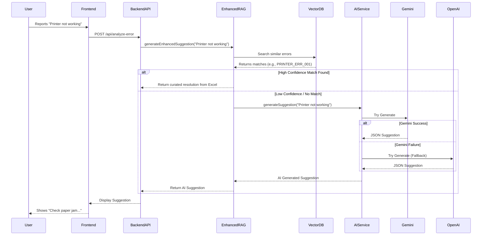

# POS Error Scenarios & AI Model Integration Strategy

## 1. Executive Summary
This document outlines the strategy to enhance the StackLens AI Suggestion Model with 40 specific Point of Sale (POS) error scenarios and a robust multi-LLM fallback architecture.

## 2. Comprehensive POS Error Categories (40 Scenarios)
We have expanded the initial list to 40 granular scenarios across 8 major categories to ensure comprehensive coverage.

### A. Hardware Malfunctions
1.  **Printer_Paper_Jam**: Receipt printer jammed or out of paper.
2.  **Printer_Connection_Lost**: Printer not detected by terminal.
3.  **Scanner_Beam_Failure**: Barcode scanner light on but not reading.
4.  **Scanner_Connection_Error**: Bluetooth/USB scanner disconnected.
5.  **Card_Reader_Not_Ready**: Payment terminal stuck in initializing state.
6.  **Card_Reader_Hardware_Fail**: Physical damage or tamper alert on reader.
7.  **Cash_Drawer_Stuck**: Drawer fails to open after transaction.
8.  **Customer_Display_Blank**: Secondary screen not showing items.
9.  **Touchscreen_Unresponsive**: Dead zones or ghost touches on main display.
10. **Scale_Calibration_Error**: Integrated weighing scale reading incorrectly.

### B. Network & Connectivity
11. **Wifi_Signal_Weak**: Intermittent packet loss causing slow sync.
12. **Gateway_Timeout**: Payment processor not responding (504).
13. **DNS_Resolution_Fail**: Unable to resolve backend API host.
14. **Local_Network_Partition**: Terminals cannot see the main server/kitchen printer.
15. **SSL_Handshake_Fail**: Certificate expiry or clock skew preventing connection.
16. **Offline_Mode_Sync_Fail**: Unable to upload offline transactions after reconnection.
17. **Firewall_Blocking**: Port 443/8080 blocked by local security software.

### C. Payment Processing
18. **Card_Declined_Insufficient**: Standard "Insufficient Funds" error.
19. **Card_Expired**: Card expiration date has passed.
20. **Invalid_PIN_Lockout**: Too many wrong PIN attempts.
21. **EMV_Chip_Read_Fail**: Chip malfunction, fallback to swipe required.
22. **Duplicate_Transaction**: Same transaction ID processed twice.
23. **Settlement_Batch_Fail**: End-of-day batch upload failed.
24. **Unsupported_Card_Type**: Card brand not enabled in merchant config.

### D. System & Performance
25. **App_Crash_Memory**: "Out of Memory" crash during heavy load.
26. **Slow_Transaction_Processing**: >10s delay in finalizing sale.
27. **Database_Lock_Wait**: UI freezes while waiting for DB write.
28. **Disk_Space_Low**: Unable to save logs or local transaction cache.
29. **Update_Failed_Rollback**: Automatic software update failed.

### E. User & Process
30. **Invalid_Login_Attempts**: User locked out after N failed tries.
31. **Price_Override_Unauthorized**: Cashier attempted discount without permission.
32. **Shift_Close_Discrepancy**: Cash in drawer does not match expected.
33. **Void_Limit_Exceeded**: Manager approval required for void.
34. **Item_Not_Found**: Scanned barcode not in local database.

### F. Data & Inventory
35. **Inventory_Sync_Conflict**: Item sold locally but out of stock in backend.
36. **Tax_Calculation_Error**: Mismatch between local and cloud tax rules.
37. **Customer_Profile_Load_Fail**: Loyalty data unavailable.

### G. Security
38. **PCI_Compliance_Warning**: Unencrypted data detected in logs.
39. **Suspicious_Refund_Activity**: High volume of refunds flagged.

### H. Integration
40. **Kitchen_Display_Disconnect**: Order not appearing on KDS.

## 3. Detailed Implementation Specifications

### 3.1. Multi-LLM Fallback Architecture (Provider Pattern)

We will move away from the hardcoded `AIService` to a modular design. This allows us to swap models without changing business logic and ensures high availability.

#### Core Components

1.  **`LLMProvider` Interface**: Defines the contract for all AI providers.
2.  **`ProviderFactory`**: Manages the creation and configuration of providers.
3.  **`AIService` (Refactored)**: Orchestrates the fallback logic.

#### Code Structure Design

```typescript
// src/services/ai/providers/types.ts
export interface LLMProvider {
  name: string;
  generateSuggestion(prompt: string): Promise<AISuggestion>;
  isConfigured(): boolean;
}

export interface AISuggestion {
  rootCause: string;
  resolutionSteps: string[];
  codeExample?: string;
  preventionMeasures: string[];
  confidence: number;
}

// src/services/ai/providers/gemini-provider.ts
import { GoogleGenerativeAI } from "@google/generative-ai";

export class GeminiProvider implements LLMProvider {
  name = "gemini";
  private client: GoogleGenerativeAI;

  constructor(apiKey: string) {
    this.client = new GoogleGenerativeAI(apiKey);
  }

  async generateSuggestion(prompt: string): Promise<AISuggestion> {
    const model = this.client.getGenerativeModel({ model: "gemini-pro" });
    const result = await model.generateContent(prompt);
    const response = await result.response;
    return this.parseResponse(response.text());
  }
  // ... helper methods
}

// src/services/ai/providers/openai-provider.ts
import OpenAI from "openai";

export class OpenAIProvider implements LLMProvider {
  name = "openai";
  private client: OpenAI;

  constructor(apiKey: string) {
    this.client = new OpenAI({ apiKey });
  }

  async generateSuggestion(prompt: string): Promise<AISuggestion> {
    const completion = await this.client.chat.completions.create({
      messages: [{ role: "user", content: prompt }],
      model: "gpt-4-turbo-preview",
      response_format: { type: "json_object" }, // Enforce JSON
    });
    return JSON.parse(completion.choices[0].message.content);
  }
}
```

#### Fallback Logic in `AIService`

The `AIService` will maintain a priority list of providers.

```typescript
export class AIService {
  private providers: LLMProvider[] = [];

  constructor() {
    // Initialize providers based on available env vars
    if (process.env.GEMINI_API_KEY) {
      this.providers.push(new GeminiProvider(process.env.GEMINI_API_KEY));
    }
    if (process.env.OPENAI_API_KEY) {
      this.providers.push(new OpenAIProvider(process.env.OPENAI_API_KEY));
    }
    // Add Anthropic, etc.
  }

  async generateSuggestion(errorText: string): Promise<AISuggestion> {
    let lastError;

    for (const provider of this.providers) {
      try {
        console.log(`Attempting generation with ${provider.name}...`);
        const suggestion = await provider.generateSuggestion(this.buildPrompt(errorText));
        return suggestion; // Success! Return immediately.
      } catch (error) {
        console.warn(`${provider.name} failed:`, error);
        lastError = error;
        // Continue to next provider
      }
    }

    // If all fail, return static fallback
    console.error("All AI providers failed. Using static fallback.");
    return this.getStaticFallback(errorText);
  }
}
```

### 3.2. Data Enrichment Strategy

We will create a `pos_error_training_data.xlsx` file. This file serves as the "ground truth" for our RAG system.

#### Excel Schema
| Column Name | Description | Example Value |
| :--- | :--- | :--- |
| `error_code` | Unique identifier for the error scenario | `PRINTER_ERR_001` |
| `error_description` | Natural language description of the error | "Receipt printer is not printing and status light is blinking red." |
| `category` | One of the 8 main categories | `HARDWARE` |
| `severity` | Critical, High, Medium, Low | `High` |
| `resolution_steps` | Semicolon-separated list of steps | "1. Open printer cover.; 2. Check for paper jam.; 3. Ensure paper roll is seated correctly.; 4. Close cover firmly." |
| `keywords` | Comma-separated keywords for search | "printer, jam, red light, receipt" |

#### Training Process
1.  **Load**: `SuggestionModelTrainingService` reads the Excel file.
2.  **Vectorize**: Each `error_description` is converted to a vector embedding.
3.  **Index**: These vectors are stored in the local Vector DB.
4.  **Query**: When a user reports "Printer stuck", the system finds the closest match (e.g., `PRINTER_ERR_001`) and returns its curated `resolution_steps`.

### 3.3. Gemini/LLM Configuration & Best Practices

To ensure reliability and correctness:

1.  **SDK Usage**: We will strictly use official SDKs (`@google/generative-ai`, `openai`, `@anthropic-ai/sdk`) instead of raw `fetch`. This handles authentication headers and basic networking issues automatically.
2.  **Structured Output**:
    *   **OpenAI**: Use `response_format: { type: "json_object" }`.
    *   **Gemini**: Use prompt engineering with specific JSON schemas in the system instruction (if available) or few-shot prompting to guarantee valid JSON.
3.  **Timeouts**: Set explicit timeouts (e.g., 10s) for each provider call to prevent hanging requests.
4.  **Retries**: The SDKs often have built-in retries (e.g., OpenAI defaults to 2). We will configure these to avoid excessive latency.

## 4. Integration Flow Diagram



## 5. Next Steps
1.  **Approval**: Confirm this detailed spec meets your expectations.
2.  **Implementation**:
    *   Install SDKs: `npm install @google/generative-ai openai @anthropic-ai/sdk`
    *   Create `src/services/ai/providers/` directory.
    *   Implement the classes defined above.
    *   Create the Excel file.
